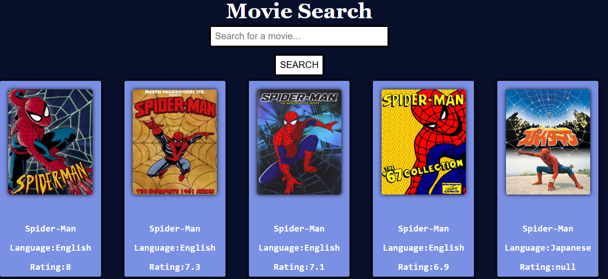
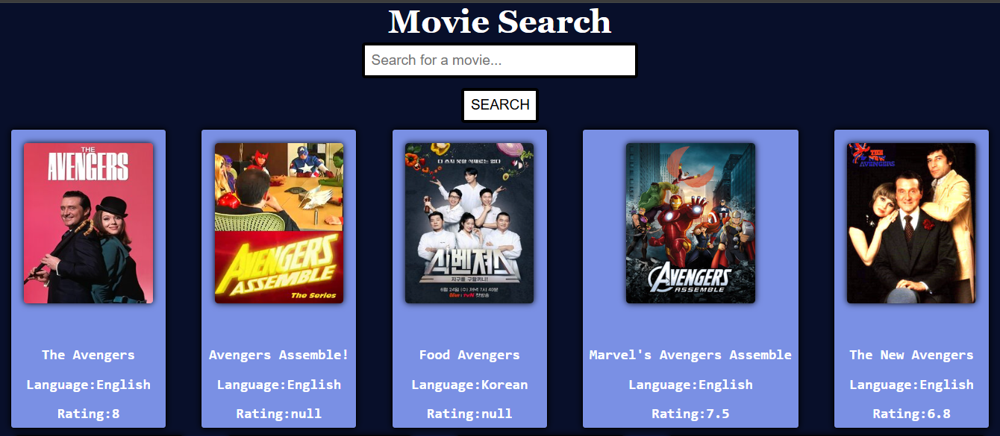
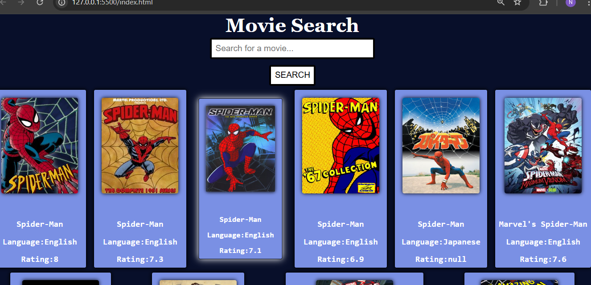
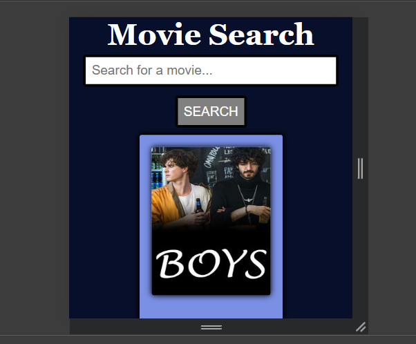

# 🎬 My-Movie-App

A responsive web application that allows users to search for TV shows and movies using the TVmaze API. The app is built using **HTML**, **CSS**, and **JavaScript**, and uses **Axios** (or Fetch) to retrieve movie data dynamically.

---

## 🔍 Features

- 🎥 Search movies or TV shows by title
- 🖼 Displays poster, title, language, and rating
- 🌐 Real-time data from [TVmaze API](https://www.tvmaze.com/api)
- 📱 Responsive layout for all devices
- 🚀 Shows default movies (e.g., Spider-Man) on page load

---

## 📸 Screenshots

### 🏠 Default View on Page Load


### 🔎 After Searching a Movie


### 🔎 Hover Effect


### 🔎 Responsiveness


---

## 🛠️ Tech Stack

- **HTML** – Structure
- **CSS** – Styling and layout
- **JavaScript** – Functionality
- **Axios/FETCH** – API call
- **TVmaze API** – Movie/show data

---
### ⭐ If You Like It
If you found this project helpful or interesting, please consider giving it a ⭐ on GitHub – it really helps and motivates!

## 🚀 How to Use

1. Clone or download the project:

```bash
git clone https://github.com/yourusername/movie-search-app.git
cd movie-search-app


